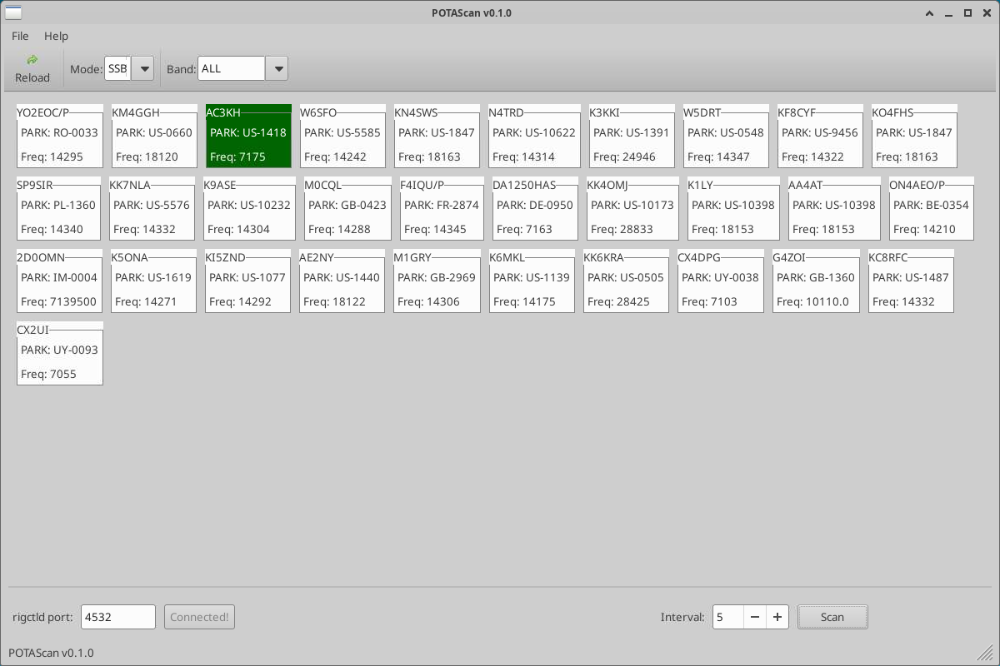

# POTAScan

POTAScan is a utility to download spots from Parks On The Air (POTA) and automatically tune your radio to them, moving to the next spot every N seconds. This makes it easy to find and work park activators by automatically scanning through active spots.



## Features

- Automatically downloads and displays current POTA spots
- Filters spots by band and mode (SSB/CW)
- Automatically tunes your radio through active spots
- Configurable scan interval
- Works with any radio supported by Hamlib's rigctld

## Requirements

- Python 3.x
- wxPython
- Hamlib
- rigctld running and connected to your radio

## Installation

1. Clone the repository:
   ```bash
   git clone https://github.com/bseidenberg/potascan.git
   ```

2. Install dependencies:
   
   **Note: I have not tested these, they were auto-generated by AI and are probably insufficient.**
  
  * Debian/Ubuntu:
     ```bash
     sudo apt-get install python3-wxgtk4.0 python3-hamlib libhamlib-dev
     ```

   * Other Linux distributions:
      - Install wxPython and Hamlib from your package manager

3. Configure your radio:
   - Ensure rigctld is running and connected to your radio. Note the port it is listening on.

## Usage

1. Run the script:
   ```bash
   python main.py
   ```
2. Set the port of your running rigctld in the bottom left(default is 4532)

3. Configure the scan interval at the bottom right(default is 5 seconds)

4. Start scanning!
   - Hit the "Scan" button at the bottom right
   - The main window will display all active POTA spots
   - Your radio will automatically tune to each spot

5. You can filter mode and band at the top

## Author

Benjamin Seidenberg (WY2K)

## Contributing

Contributions are welcome! Please feel free to submit a Pull Request.

## License

This project is licensed under the GPL-3.0 License. See the [COPYING](COPYING) file for details.
